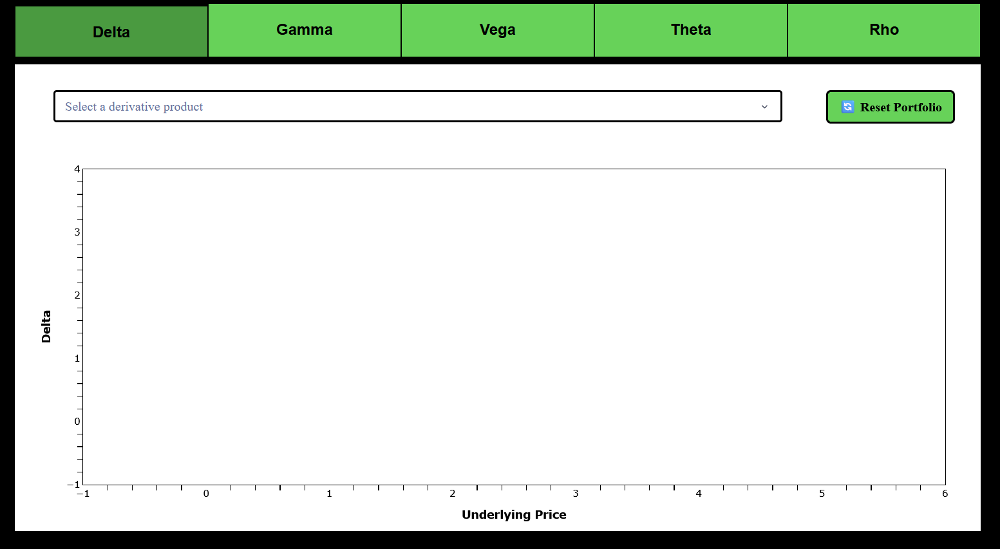
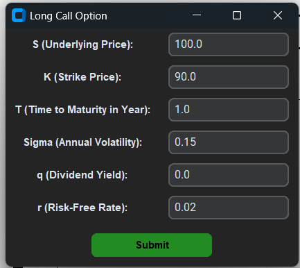
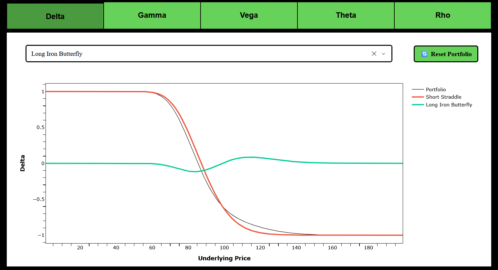

# Finance Greeks Visualization App

## Description

This Python application is an interactive interface developed with Dash for visualizing financial Greeks (Delta, Gamma, Vega, Theta, Rho) of various derivative products. It allows users to add derivative positions (options, straddles, spreads, etc.) and visualize the evolution of their Greeks based on the underlying price or interest rate.

I decided to create this app to help finance students better visualize the Greeks and see the different impacts of products on a portfolio.

## Features

- **Derivative product selection**: Dropdown with a complete list of derivatives (simple options, straddles, strangles, butterflies, iron condors, spreads, Asian options, etc.)
- **Greeks visualization**: Tabs to navigate between Delta, Gamma, Vega, Theta and Rho
- **Adding positions**: User interface to enter parameters for each derivative (strike price, volatility, interest rate, etc.)
- **Global portfolio**: Display of the aggregated curve of the portfolio when multiple positions are added
- **Reset**: Button to clear all positions and start over
- **Interactive charts**: Use of Plotly for dynamic and responsive charts

## Usage

1. **Select a Greek**: Use the tabs at the top to choose the Greek to visualize (Delta, Gamma, etc.).

2. **Add a derivative**: Choose a product from the dropdown and fill in the required parameters in the popup window that appears.



3. **Enter arguments**: The interest of this project is to see the behavior of Greeks in relation to variables and their impact on a portfolio. When you choose a derivative product, a tkinter window appears in which you can enter your own inputs.



4. **Visualize**: The chart updates automatically with the new position.



5. **Reset**: Click the "🔄 Reset Portfolio" button to clear all data and start over.

## Project Structure

```
├── run.py               # Python script to run the app
├── requirements.txt     # Requirements
├── README.md            # README file
└── app/
    ├── main.py          # Main Dash application
    ├── file.py          # Data management and Greeks calculations
    ├── widgets.py       # User interface for parameter input
    ├── functions.py     # Utility functions and derivative models
    ├── check_errors.py  # User input validation
    └── assets/
        └── header.css   # Custom CSS styles
        ├── 00.png       # Image 1
        ├── 01.png       # Image 2
        ├── 02.png       # Image 3
        └── favicon.ico  # Logo
```

## Dependencies

- `dash`: Web framework for the application
- `plotly`: Charting library
- `numpy`: Numerical calculations
- `pandas`: Data manipulation
- `customtkinter`: Modern user interface
- `CTkMessagebox`: Dialog boxes
- `blackscholes`: Black-Scholes models
- `inspect`: Python introspection
- `math`: Numerical calculations
- `scipy`: Numerical calculations


The application uses the Black-Scholes model to obtain the Greeks using the [blackscholes](https://pypi.org/project/blackscholes/) library. The difficulty is that the number of derivative products is limited on this library, so I built my own formulas to calculate Asian options.

Anyone can add the derivative products they want directly in the `functions.py` file. I personally wanted to only include products that were pricable with Black-Scholes because with other methods (binomial trees, Monte-Carlo, ...) depend on the parameters you put, so the Greeks can be different.

## List of Available Derivative Products

The list of all the derivatives in the app are:

    'Call Option'
    'Put Option'
    'Straddle'
    'Strangle'
    'Butterfly'
    'Iron Condor'
    'Iron Butterfly'
    'Binary Call'
    'Binary Put'
    'Bear Spread'
    'Bull Spread'
    'Calendar Call Spread'
    'Calendar Put Spread'
    'Asian Call'
    'Asian Put'

For all of these derivatives there are two possibilities: long and short.

## Launch the Script

Run

```
pip install -r requirements.txt
```

and

```
python run.py
```

Then, visit http://127.0.0.1:8050/ to see the app or click on the Flask serveur that is in your terminal.